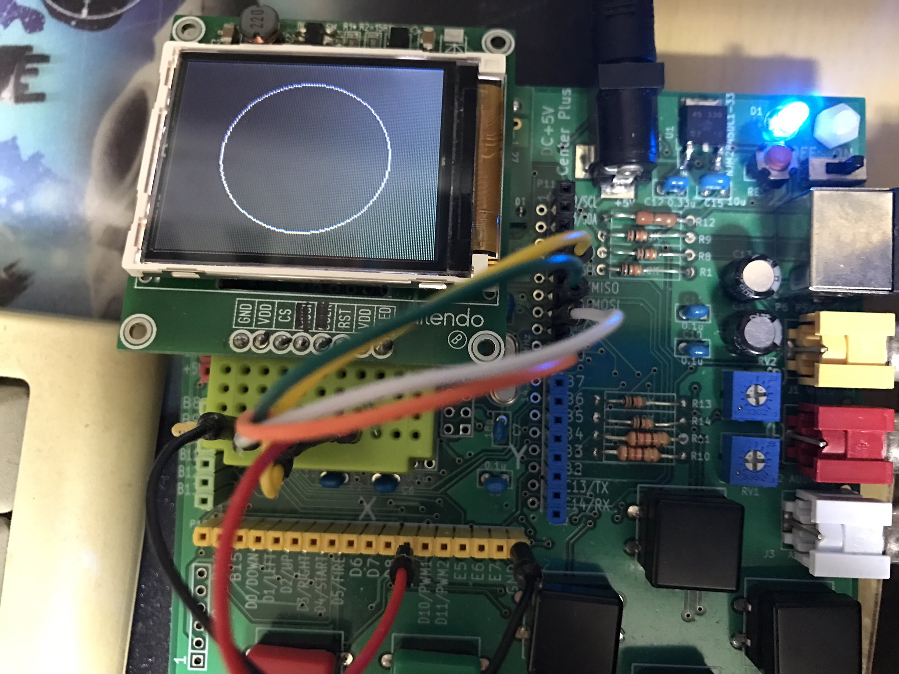
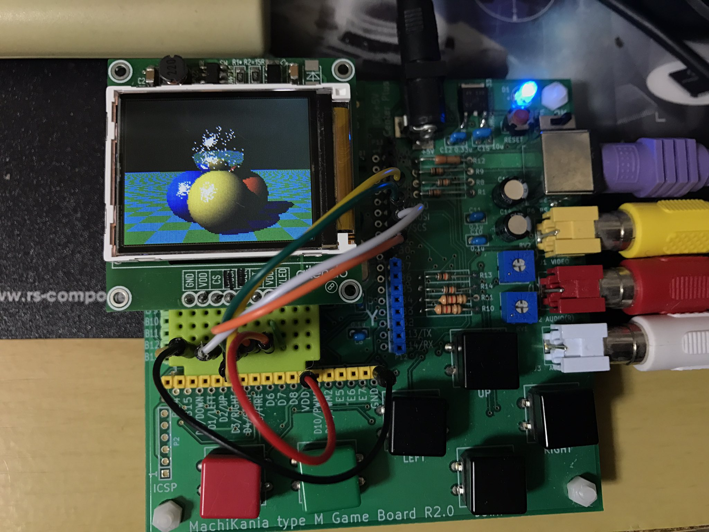

# 1.77型LCD　TFT2P0327-E（SPI接続）
aitendoで購入した128×160ドット1.77型LCD TFT2P0327-EをMachiKania type MのBASICで制御しました。SPI接続用キャリー基板M2P0327E-Bを使用しました。  

## ピンアサイン
LCD　　　MachiKania  
 CS　　　　D9  
 RST　　　 B0  
 MOSI　　　G9  
 SCLK　　　F6  
